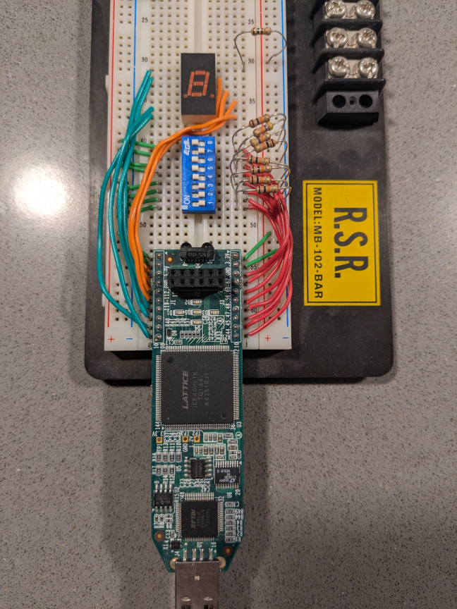

# verilog-playground
Just a collection of random verilog experimentation with tools like icestorm.

---

## lfsr-7seg
Generate an 8-bit LFSR with taps specified by input pins and output to a
7-segment display.  
Targets Lattice Icestick with dipswitch on J3 and 7-segment display on J1.
The display will show the lower nibble of the LFSR.



### Dependencies
yosys toolchain
nextpnr-ice40
icestorm tools

### Building
```sh
make        # build the binary
make prog   # program the icestick
make clean  # delete the output
```

### Usage
When you modify the dip switch settings on J3, the taps for the LFSR will be
updated. Modifying the taps will cause the LFSR to initially reset to its
initial value (0x01).  
Switch input 1 is the x^1 tap, switch input 8 is x^8.  
To get a maximal length LFSR sequence, try setting the switch values to
00011101 (0xB8).

The 7-segment display on J3 will display the lower nibble of the shift register.
It would be pretty straightforward to add another 7-segment to J2 in order to
display the full byte.

The LFSR automatically increments in its sequence at approximately 0.7 Hz.  
When it does, it blinks the decimal point on the display.

---
